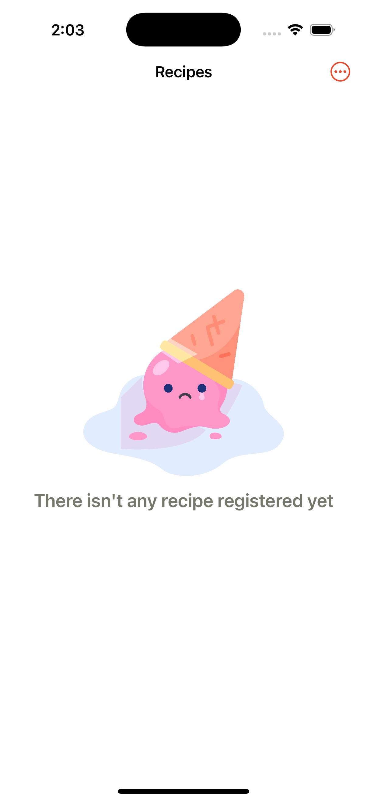

# RecipeApp

### Summary: Include screenshots or a video of your app highlighting its features
| Home | Detail | Empty | Failure |
|-|-|-|-|
|  |  |  |  |
|  |  |  |  |

### Demo video

### Focus Areas: What specific areas of the project did you prioritize? Why did you choose to focus on these areas?
- Focused on optimizing the user experience by ensuring an intuitive, smooth, and functional interface.
- Designed a scalable architecture using MVVM, integrating a router and coordinator to improve navigation management and separation of concerns.
- Leveraged Swift Concurrency (async/await) to efficiently handle background operations, ensuring a seamless and responsive UI.
- Optimized web content and video loading using WebKit, utilizing its native capabilities for enhanced efficiency and performance.
- Implemented image caching to minimize unnecessary network requests, reducing load times and improving the overall user experience.
- Developed a robust view state management system, ensuring efficient handling of different loading, success, and error states.
- Adopted the new Swift Testing framework to implement more efficient testing strategies, improving code quality and stability.

### Time Spent: Approximately how long did you spend working on this project? How did you allocate your time?
- I allocated one day to the project, focusing on implementing essential changes without over-optimizing prematurely.
- I prioritized architectural robustness over premature fine-tuning, ensuring a scalable and maintainable foundation for future development.

### Trade-offs and Decisions: Did you make any significant trade-offs in your approach?
- I focused on performance and stability, ensuring the app avoided memory leaks and delivered a smoother user experience.
- I prioritized native Swift functionalities to avoid unnecessary dependencies, keeping the codebase lightweight, efficient, and easy to maintain.

### Weakest Part of the Project: What do you think is the weakest part of your project?
- The weakest part of the project was the use of WKWebView to display videos within the app. Since iOS 16, Apple has not fully optimized this component, which can lead to performance or compatibility issues in certain cases. However, I conducted thorough research and identified solutions to mitigate these issues, ensuring a more stable user experience.

### Additional Information: Is there anything else we should know? Feel free to share any insights or constraints you encountered.
- I did not encounter any significant constraints during development. However, an improvement could have been implementing multiple HTTP Methods in the API for greater flexibility. Additionally, centralizing search filtering directly on the API rather than handling it on the client side would have optimized performance and reduced the application's workload.
